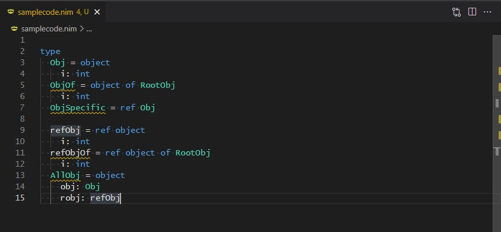
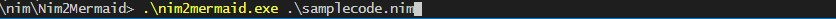
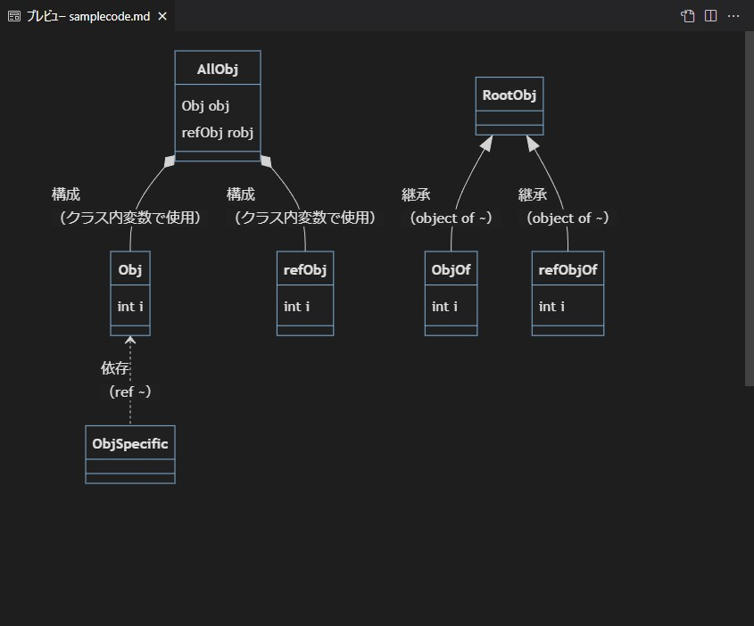

# Nim2Mermaid
Nimのクラス図をMermaidに起こします

## Demo
1. コード
  

2. 変換
  

3. クラス図
  

## Getting started
Windows
```
git clone https://github.com/we-can-panic/Nim2Mermaid

nim c nim2mermaid.nim

.\nim2mermaid.exe mermaid_sample.nim
```

