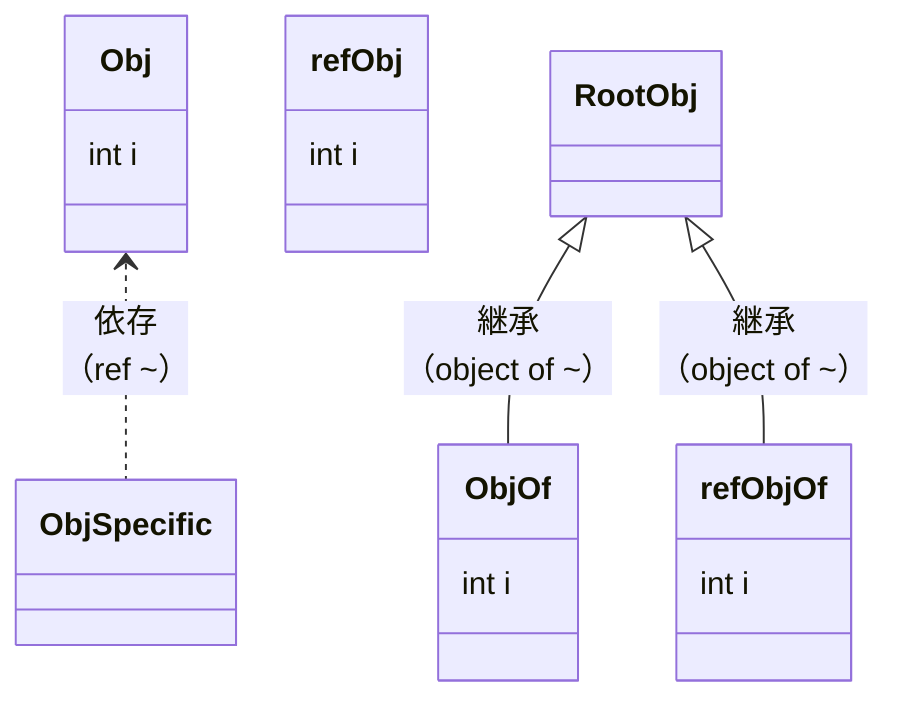

```mermaid
classDiagram

class Obj {
  int i
}
class ObjOf {
  int i
}
class ObjSpecific {
  
}
class refObj {
  int i
}
class refObjOf {
  int i
}

RootObj <|-- ObjOf: 継承<br>（object of ~）
Obj <.. ObjSpecific: 依存<br>（ref ~）
RootObj <|-- refObjOf: 継承<br>（object of ~）
```